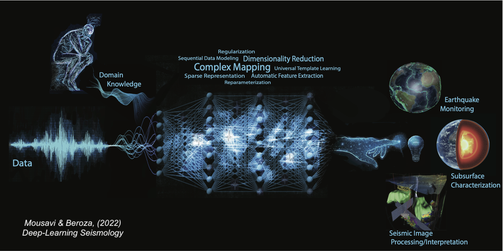

## Deep-Learning Seismology

### This page contains the database, interactive plots, and supplementary materials for ["Deep-Learning Seismology"](https://www.science.org/stoken/author-tokens/ST-669/full)paper. 



### Database
This is a dataset of 637 journal papers (last update Feb 2022) applying neural networks for various tasks in seismology spanning January 1988 to January 2022. The dataset mainly includes peer reviewed papers and does not contain duplicated works. It follows a hierarchical classification of papers based on seismological tasks (i.e. category, sub_category_I, sub_category_II, task, and sub_task). For each paper following information are provided: 1) first author's last name, 2) publication year, 3) paper's title, 4) journal 's name, 5) machine learning method used, 6) the type of used neural network, 7) the name of neural network architecture, 8) the number of neurons/kernels in each hidden layer, 9) type of training process, i.e. supervised, semi-supervised, etc, 10) input data into the network, 11) output data, 12) data domain, i.e. time, frequency, feature, etc, 13) the type of data used for training, e.g. synthetic or real data, 14) the size of training set, 15) the metrics used to measure the performance, 16) performance scores, 17) the baseline method used for evaluation, and 18) a short note summarizing the paper's objective, its approach, and its significance. 

You can find a freezed and citable version of our database (as used in the paper) [here](https://zenodo.org/record/6386952#.YkT3fBPMJqs)

You can find an updating version of our database [here](https://github.com/smousavi05/dl_seismology/blob/main/docs/paper_inventory_deep.csv)

#### This is an example of data structure in our database:

```markdown
   {
    "ref": "Yang_2019_yang2019deep",
    "title": "Deep-learning inversion: A next-generation seismic velocity model building method",
    "journal": "Geophysics",
    "category": "Inverse Problems",
    "sub_category_I": "Active Seismology", 
    "sub_category_II": "Subsurface Characterization", 
    "task": ["Velocity Model Building"],
    "sub_task": "Prestack", 
    "ml_type": ["ANN"],
    "network_type": ["CNN"],
    "network_name": ["U-Net"],
    "architecture":[64, 64, 128, 128, 512, 512, 1024, 1024, 512, 512, 256, 256, 128, 128, 64],
    "training_process": ["Supervised_Learning", "Transfer_Learning"],
    "inputs": ["multishot gathers"],
    "outputs": ["predicted velocity model"],
    "data_domain": ["time"],
    "data_type": ["synthetic"],
    "data_size": [1600],		
    "performance_metrice": [],
    "performance_score": [],
    "baseline": ["FWI"],
    "notes": "The main contribution of this paper is the use of U-Net. The prediction in the model space has dimensions of 201# 301; interestingly, the spatial dimensions of the input coincide with the second spatial dimension of the predictions, which is basically the number of receivers per shot. The U-Net architecture on the encoder side is composed by 10 2D convolutional layers interleaved with batch normalization and using ReLU as the activation function. For connecting layers, every two 2D convolutional layers are placed between the encoder and decoder. The decoder section is composed of eight 2D convolutional layers and interleaved with the corresponding deconvolution layers. The ADAM optimizer is using during training, with two different numbers of epochs, depending on which data set is used as input, learning rate, and batch size constant. Results are presented as the comparison between the CNN predictions and a MS-FWI solver, for which the starting model is a smoothed version of the ground truth. The first set of results (for a CNN trained with synthetic data) presented is competitive with FWI solutions; the salt bodies are identified and properly placed, but the boundaries are less continuous than the FWI solution, as can observed in Figure 12(c)."
	},
 ```
 
#### You can cite the paper as:

```markdown
	Mousavi, S. M., & Beroza, G. C. (2022). Deep-learning seismology. Science, 377(6607), eabm4470.
```

 BibTeX:
```markdown
	article{
	doi:10.1126/science.abm4470,
	author = {S. Mostafa Mousavi  and Gregory C. Beroza },
	title = {Deep-learning seismology},
	journal = {Science},
	volume = {377},
	number = {6607},
	pages = {eabm4470},
	year = {2022},
	doi = {10.1126/science.abm4470},
	URL = {https://www.science.org/doi/abs/10.1126/science.abm4470},
	eprint = {https://www.science.org/doi/pdf/10.1126/science.abm4470},
	abstract = {}}
```

#### You can cite the dataset as:

```markdown
	S. Mostafa Mousavi, & Gregory Beroza. (2022). A dataset of published journal papers using neural networks for seismological tasks. (Version 101)  [Data set]. Zenodo. https://doi.org/10.5281/zenodo.6386952
 ```
 
 BibTeX:

```markdown
	 @dataset{s_mostafa_mousavi_2022_6386952,
	  author       = {S. Mostafa Mousavi and
			  Gregory Beroza},
	  title        = {{A dataset of published journal papers using neural 
			   networks for seismological tasks.}},
	  month        = mar,
	  year         = 2022,
	  publisher    = {Zenodo},
	  version      = 101,
	  doi          = {10.5281/zenodo.6386952},
	  url          = {https://doi.org/10.5281/zenodo.6386952}
	}
 ```

### Editing The Database

You can modify or add your paper information into the database through submitting a ***pull request***. 
To do so follow these steps:

1. Fork the [dl_seismology](https://github.com/smousavi05/dl_seismology)
2. Create your feature branch (git checkout -b my-new-feature)
3. Commit your changes (git commit -am 'Add some feature'). You can use GitHub editor directly to change the CSV
4. Push to the branch (git push origin my-new-feature)
5. Create a new Pull Request


### Interactive Plots

Here you can see the interactive plots for [Figure_3a](https://smousavi05.github.io/dl_seismology/figure_3a.html) and [Figure_3b](https://smousavi05.github.io/dl_seismology/figure_3b.html).

These plots present hierarchical distribution of studies in our database based on the seismological applications (a) and used neural network types (b).


### ML-Seismology Glossary

You can find an updating glossary of seismological tasks and relevant machine learning techniques [here](https://smousavi05.gitbook.io/mlseismology/)


